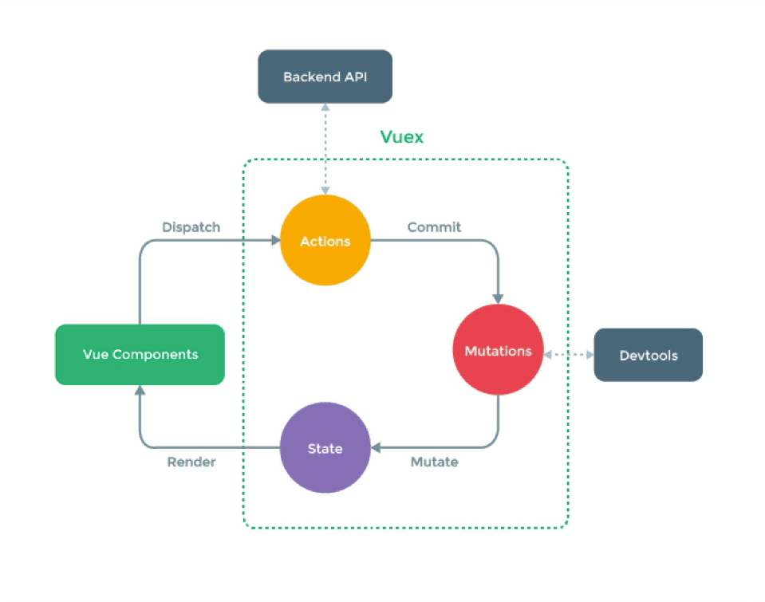

# Vuex

Posiblemente hayan escuchado sobre Redux, RxJS y que ofrecen un estado reactivo, o algunos patrones como BloC.

Uno de los problemas que nos encontramos, es que los estados se almacenan sólo en los componentes y se los pasamos hacia los demás componentes a través de properties.

## Cuál es la diferencia entre las properties y los attributes?

| Propiedad | Atributo |
| --------- | ------- |
| Las propiedades las colocamos específicamente en el componente dónde las vamos a recibir | Los atributos no los especificamos y son opcionales. |

Vuex es una librería que nos permite almacenar estados en componentes, maneja el estado global en la aplicación. Es un gestor de estado en Vue.

VueX trabaja como trabaja vue por defecto. Es un gestor de estado muy popular en vue. Sólo que en lugar de tenerlo en un componente, lo tenemos en la aplicación. Y se ubica en lo más alto de la jerarquía de componentes.

- **Acciones** Las acciones por naturaleza son asíncronas y sirven para hacer peticiones HTTP o tareas que sean asíncronas.
- **Mutations** Son mutaciones y son síncronas, son las que midifican el state.
- **State** Es un objeto reactivo muy parecido a lo que tenemos en la data de vue.
- **Getters** Son como los computed properties de vue. (Es una forma preprocesada para obtener datos del state).

> :bulb: Es recomendado trabajar VueX en módulos de una vez, por ejemplo en el módulo de usuario, autenticación, carrito de compras, etc. Y no cargar todo de una vez de forma global porque vueX agrega mucha complejidad.

Esta sección es muy importante para comprender Vuex, el cual es un gestor de estado muy popular cuando sabemos que las aplicaciones serán de mediana a gran escala. VueX será el gestor de estado global de nuestra aplicación.

## VueX - Introducción.

Las aplicaciones tiene componentes, dentro de componentes y así sucesivamente. Y muchas veces no tenemos una comunicación directa entre componentes, sino que tenemos que pasar información de un componente a otro.

La idea de VueX es que tengamos un Store, y que la información que necesite la aplicación la consultemos desde el Store.

- El state del store es un objeto reactivo.

Prácticamente el flujo de información funciona de la siguiente manera cíclica.
- View
- Actions
- State



Las acciones pueden ser síncronas o asíncronas y éstas pueden realizar peticiones HTTP. Las mutaciones son síncronas y como el State es reactivo notificará a los componentes.

- Las **acciones** pueden ser asíncronas.
- Los **commits** DEBEN ser síncronos.
- Una acción NO debe modificar directamente el state.

## Conceptos generales

- **State**: Similar a la `data()`, es reactivo.
- **Getters**: Similar a las propiedades computadas.
- **Mutations**: Funciones que _pueden_ modificar el state.
- **Actions**: Funciones que pueden ser asíncronas que pueden llamar mutations.
- **Modules**: Agrupador de state, getters, mutations, actions y otros módulos.
- **Store**: Es un objeto que contiene todos los módulos.


## Cuándo usar Vuex?

- [x] VueX nos ayuda a lidiar con la gestión de estado compartida por el costo de mayor estructura y archivos.
- [x] Es una compensación entre la productividad a corto y a largo plazo.

Vuex no es complicado de implementar, lo único complicado es entender al principio su estructura y funcionamiento.

Para la creación del proyecto, usamos
- **`vue create bases-vuex`**

Escogemos babel y el linter. Vuex no lo instalamos porque lo haremos de forma manual.

## Instalación manual de Vuex

Vuex es un patrón de gestión de estado + biblioteca para aplicaciones Vue.js. Sirve como un almacén centralizado para todos los componentes de una aplicación, con reglas que garantizan que el estado solo se puede modificar de forma predecible.

[Vuex](https://vuex.vuejs.org/)

- **`npm install vuex@next --save`**

## Leer el state reactivo.

Para leer el state desde vue, tenemos 3 formas:
1. Leerlo directamente usando **`{{ $store.state.nombreDelState }}`**
2. A través de propiedades computadas.

```js	
computed: {
    countComputed() {
        return this.$store.state.count;
    }
}
```

3. Usando la desestructuración de objetos y usando el método **mapState**.

```js
import { mapState } from 'vuex'

...
computed: {
        countComputed() {
            return this.$store.state.count;
        },
        ...mapState(['count', 'lastMutation'])
}
```

> Lo más común es usar el método **`mapState`** para leer el state reactivo.

## Mutations

La mutación es para modificar el state.

Las mutaciones prácticamente son métodos que van a estar ahí para hacer la modificación del state.

Las mutaciones son las que cambian directamente el state.

Se definen las mutaciones en el store.

```js
import { createStore } from "vuex"

export default createStore({
    state: {
        count: 1,
        lastMutation: 'none'
    },

    mutations: {
        incement(state) {
            state.count++
            state.lastMutation = 'increment'
        },
        incrementBy(state, amount) {
            state.count += amount
            state.lastMutation = 'incrementBy'
        },
        decrement(state) {
            state.count--
            state.lastMutation = 'decrement'
        }
    }
})
```

Y luego en el componente se llama el método que requiero aplicar la mutación usando el **commit**. Las **mutaciones** son **síncronas**.

```js
export default {
    ...

    methods: {
        increment() {
            this.$store.commit('incement');
        },
        incrementBy() {
            this.$store.commit('incrementBy', 5);
        }
    }
}
```

## Actions

Las acciones son métodos que pueden ser asíncronas. Generalmente son las acciones que permiten consultar algo en el backend, las acciones son despachadas **dispatch()**.

Como las acciones no modifican el estate, las acciones modifican el state mediante una mutación.

El context, tiene referencia sobre el contexto del store o el módulo que se esté trabajando. Como las mutaciones reciben el **state**, las acciones reciben el **context**

Las acciones se definen en el método *actions*

```js
export default createStore({
    ...
    actions: {
        async incrementRandomInt(context) {
            const randomInt = await getRandomInt()
            context.commit('incrementBy', randomInt)
        }
    }
})
```

Y para llamarlas, se usa el método **dispatch**.

```js
export default {
    ...

    methods: {
        incrementRandomInt() {
            this.$store.dispatch('incrementRandomInt')
        }
    }
}
```

## `mapActions`

Los mapActions permiten desestructurar las acciones, para que se puedan usar en el componente, sin usar las referencias directas.

Al tenerse el mapActions, se puede llamar las acciones dentro del componente.

```js
import { mapActions } from 'vuex'
methods: {
    ...
    // ...mapActions(['incrementRandomInt'])
    ...mapActions({
        randomInt : 'incrementRandomInt'
    })
}
```

## Bloquear botón mientras una acción se ejecuta.

Las acciones se pueden bloquear, usando el vbind en las vistas, de forma que bloqueen partes de la aplicación. Esto lo podemos hacer, mediante el estado de carga de una acción en particular, es decir, que cuando `isLoading` es true, el botón se bloquea.


```js
actions: {
    // async incrementRandomInt(context)
    async incrementRandomInt({commit}) {
        commit('setLoading', true)
        const randomInt = await getRandomInt()
        commit('incrementBy', randomInt)
        commit('setLoading', false)
    }
}
```

```vue
<template>
    ...
    <button @click="randomInt" :disabled="isLoading">Random</button>
</template>

<script>
import { mapState, mapActions } from 'vuex'

export default {
    ...
    computed: {
        ...mapState(['count', 'lastMutation', 'isLoading'])
    }
    ...
}
</script>
```

## Getters

Los getters pueden ser llamados en cualquier parte de la aplicación. Son como las propiedades computadas en Vue.

Los getters también reciben como argumento el **state**

> Los getters se van a actualizar cuando el state cambie.

```js
...
    getters: {
        squareCount(state) {
            return state.count * state.count
        }
    }
...
```

## Módulos

Debido al uso de un solo árbol de estado, todos los estados de nuestra aplicación están contenidos dentro de un gran objeto. Sin embargo, a medida que nuestra aplicación crece en escala, el **store** puede volverse realmente molesto.

[Módulos en Vuex](https://vuex.vuejs.org/guide/modules.html)

Cuando usamos vuex, es porque sabemos que nuestra aplicación va a ser mucho más compleja.

La idea de usar módulos es que todo tenga un orden lógico.

Muchas tecnologías como Quasar, ya crean la estructura necesaria por módulos para no tener que hacer eso manualmente.

Para crear módulos, usamos el método **module** y dentro de él se llama la lógica del respectivo módulo.

```js
import { createStore } from "vuex"
import counterStore from "./counter"

export default createStore({
    modules: {
        counter: counterStore
    }
})
```

Y en el counterStore, se define un objeto con la lógica del módulo.

```js
import getRandomInt from "../../helpers/getRandomInt";
const counterStore = {
    namespaced: true,
  // Esto permite que el componente tenga los datos de forma reactiva
  state: () => ({
    count: 1,
    lastMutation: "none",
    isLoading: false,
  }),

  mutations: {
    incement(state) {
      state.count++;
      state.lastMutation = "increment";
    },
    incrementBy(state, amount) {
      state.count += amount;
      state.lastMutation = "incrementBy " + amount;
    },
    decrement(state) {
      state.count--;
      state.lastMutation = "decrement";
    },
    setLoading(state, isLoading) {
      state.isLoading = isLoading;
    },
  },

  actions: {
    // async incrementRandomInt(context)
    async incrementRandomInt({ commit }) {
      commit("setLoading", true);
      const randomInt = await getRandomInt();
      commit("incrementBy", randomInt);
      commit("setLoading", false);
    },
  },

  getters: {
    squareCount(state) {
      return state.count * state.count;
    },
  },
}

export default counterStore
```

Al definirse la propiedad **`namespaced: true,`** indicamos que el módulo es un módulo independiente y esto nos permite tener múltiples métodos con el mismo nombre sin que uno interfiera con el otro.


## Actions, Getters, Mutations y State desde un módulo

Ajustamos el módulo para que todos los métodos sean accesibles desde el módulo.

Para ello, solo debemos cambiar la referencia del estado a los submódulos definidos.

```vue
<template>
    <h2>Direct access: {{ $store.state.counter.count }} </h2>   
</template>
```

Y para los métodos de desestructuración, le pasamos por primer parámetro el nombre del módulo que deseamos obtener. Tanto en **mapState** como en **mapActions**.

```js
export default {
    name: 'Counter',

    computed: {
        countComputed() {
            return this.$store.state.counter.count;
        },
        ...mapState('counter', ['count', 'lastMutation', 'isLoading'])
    },

    methods: {
        increment() {
            this.$store.commit('counter/incement');
        },
        incrementBy() {
            this.$store.commit('counter/incrementBy', 5);
            // this.randomInt()
        },
        ...mapActions('counter',['incrementRandomInt'])
    }
}
</script>
```


## Separar módulos en archivos independientes

Separar cada uno de los módulos en archivos independientes es una buena práctica, es decir sacar el state, mutations, actions y getters de cada módulo a un archivo independiente.

Los archivos serían:
- `actions.js`
- `getters.js`
- `mutations.js`
- `state.js`

Y sencillamente en el archivo principal del módulo, llamamos cada archivo que contiene cada una de las partes de vuex

```js
import state from "./state";
import * as mutations from "./mutations";
import * as actions from "./actions";
import * as getters from "./getters";

const counterStore = {
  namespaced: true,
  state,
  mutations,
  actions,
  getters,
};

export default counterStore;
```